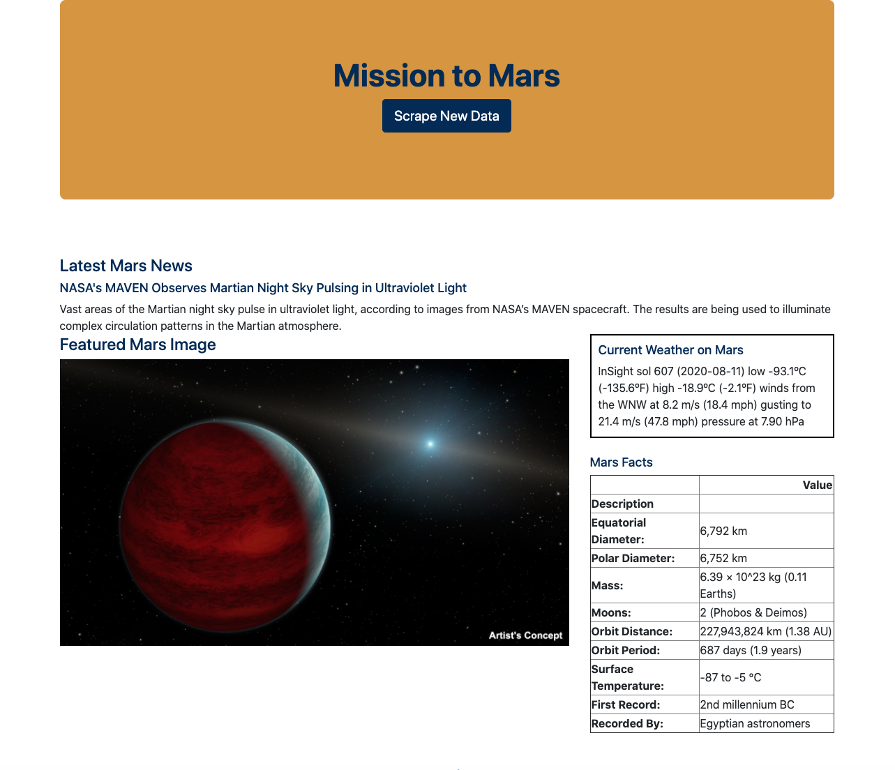
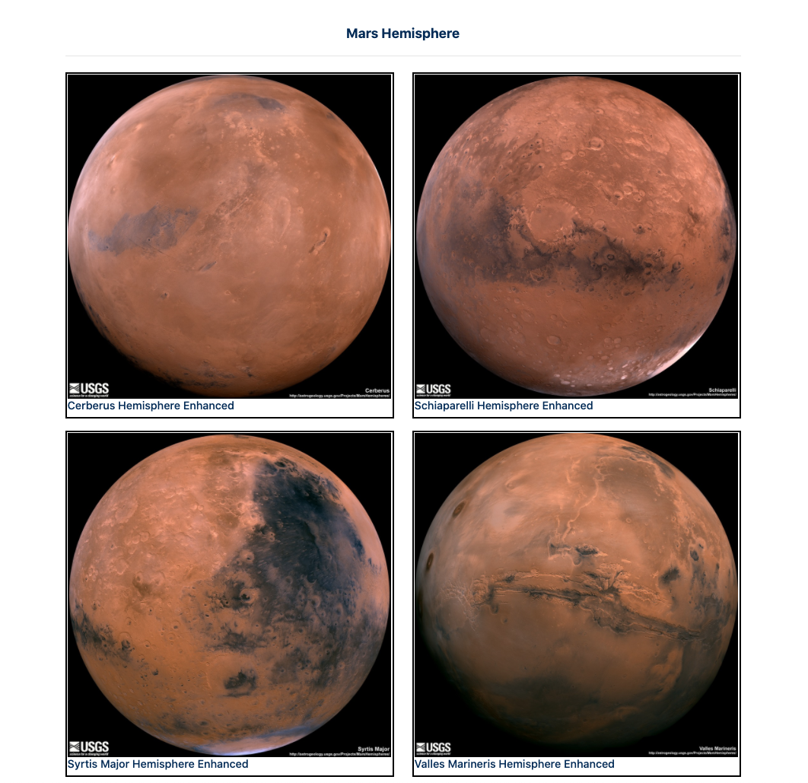

# Web Scraping Homework - Mission to Mars


In this Project, I build a web application that scrapes various websites for data related to the Mission to Mars and displayed the information in a single HTML page.

## Step 1 - Scraping

The initial scraping is conducted by using Jupyter Notebook, BeautifulSoup, Pandas, and Requests/Splinter, and a Jupyter Notebook file called [mssion_to_mars.ipynb](Missions_to_Mars/mssion_to_mars.ipynb) is used to complete all the scraping and analysis tasks.

### NASA Mars News

* I scraped the [NASA Mars News Site](/mars.nasa.gov/news/) and collected the latest News Title and Paragraph Text. The result looks as follows:

```python
Title:  NASA's MAVEN Observes Martian Night Sky Pulsing in Ultraviolet Light
Paragraph:  Vast areas of the Martian night sky pulse in ultraviolet light, according to images from NASA’s MAVEN spacecraft. The results are being used to illuminate complex circulation patterns in the Martian atmosphere.
```

### JPL Mars Space Images - Featured Image

* I Visited the url for JPL Featured Space Image [here](https://www.jpl.nasa.gov/spaceimages/?search=&category=Mars), and used splinter to navigate the site and find the image url for the current Featured Mars Image and assign the url string to a variable called `featured_image_url`.

* The image url is setuped to the full size `.jpg` image, and saved a complete url string for this image.
The output looks as follows:

```python
https://www.jpl.nasa.gov/spaceimages/images/mediumsize/PIA19346_ip.jpg
```

### Mars Weather

* I Visited the Mars Weather twitter account [here](https://twitter.com/marswxreport?lang=en), and scraped the latest Mars weather tweet from the page.Then, I saved the tweet text for the weather report as a variable called `mars_weather`.

The output looks as follows:

```python
InSight sol 607 (2020-08-11) low -93.1ºC (-135.6ºF) high -18.9ºC (-2.1ºF)
winds from the WNW at 8.2 m/s (18.4 mph) gusting to 21.4 m/s (47.8 mph)
pressure at 7.90 hPa
```

### Mars Facts

* I Visited the Mars Facts webpage [here](https://space-facts.com/mars/) and used Pandas to scrape the table containing facts about the planet including Diameter, Mass, etc and converted the data to a HTML table string.

The output looks as follows:

### Table

<table border="1" class="dataframe">
  <thead>
    <tr style="text-align: right;">
      <th></th>
      <th>Value</th>
    </tr>
    <tr>
      <th>Description</th>
      <th></th>
    </tr>
  </thead>
  <tbody>
    <tr>
      <th>Equatorial Diameter:</th>
      <td>6,792 km</td>
    </tr>
    <tr>
      <th>Polar Diameter:</th>
      <td>6,752 km</td>
    </tr>
    <tr>
      <th>Mass:</th>
      <td>6.39 × 10^23 kg (0.11 Earths)</td>
    </tr>
    <tr>
      <th>Moons:</th>
      <td>2 (Phobos &amp; Deimos)</td>
    </tr>
    <tr>
      <th>Orbit Distance:</th>
      <td>227,943,824 km (1.38 AU)</td>
    </tr>
    <tr>
      <th>Orbit Period:</th>
      <td>687 days (1.9 years)</td>
    </tr>
    <tr>
      <th>Surface Temperature:</th>
      <td>-87 to -5 °C</td>
    </tr>
    <tr>
      <th>First Record:</th>
      <td>2nd millennium BC</td>
    </tr>
    <tr>
      <th>Recorded By:</th>
      <td>Egyptian astronomers</td>
    </tr>
  </tbody>
</table>

### HTML
<table border="1" class="dataframe">
  <thead>
    <tr style="text-align: right;">
      <th></th>
      <th>Value</th>
    </tr>
    <tr>
      <th>Description</th>
      <th></th>
    </tr>
  </thead>
  <tbody>
    <tr>
      <th>Equatorial Diameter:</th>
      <td>6,792 km</td>
    </tr>
    <tr>
      <th>Polar Diameter:</th>
      <td>6,752 km</td>
    </tr>
    <tr>
      <th>Mass:</th>
      <td>6.39 × 10^23 kg (0.11 Earths)</td>
    </tr>
    <tr>
      <th>Moons:</th>
      <td>2 (Phobos &amp; Deimos)</td>
    </tr>
    <tr>
      <th>Orbit Distance:</th>
      <td>227,943,824 km (1.38 AU)</td>
    </tr>
    <tr>
      <th>Orbit Period:</th>
      <td>687 days (1.9 years)</td>
    </tr>
    <tr>
      <th>Surface Temperature:</th>
      <td>-87 to -5 °C</td>
    </tr>
    <tr>
      <th>First Record:</th>
      <td>2nd millennium BC</td>
    </tr>
    <tr>
      <th>Recorded By:</th>
      <td>Egyptian astronomers</td>
    </tr>
  </tbody>
</table>


### Mars Hemispheres

* Visit the USGS Astrogeology site [here](https://astrogeology.usgs.gov/search/results?q=hemisphere+enhanced&k1=target&v1=Mars) to obtain high resolution images for each of Mar's hemispheres.

* You will need to click each of the links to the hemispheres in order to find the image url to the full resolution image.

* Save both the image url string for the full resolution hemisphere image, and the Hemisphere title containing the hemisphere name. Use a Python dictionary to store the data using the keys `img_url` and `title`.

* Append the dictionary with the image url string and the hemisphere title to a list. This list will contain one dictionary for each hemisphere.


```python
# Example:
hemisphere_image_urls = [
    {"title": "Valles Marineris Hemisphere", "img_url": "..."},
    {"title": "Cerberus Hemisphere", "img_url": "..."},
    {"title": "Schiaparelli Hemisphere", "img_url": "..."},
    {"title": "Syrtis Major Hemisphere", "img_url": "..."},
]
```

- - -

## Step 2 - MongoDB and Flask Application

Use MongoDB with Flask templating to create a new HTML page that displays all of the information that was scraped from the URLs above.

* Start by converting your Jupyter notebook into a Python script called `scrape_mars.py` with a function called `scrape` that will execute all of your scraping code from above and return one Python dictionary containing all of the scraped data.

* Next, create a route called `/scrape` that will import your `scrape_mars.py` script and call your `scrape` function.

  * Store the return value in Mongo as a Python dictionary.

* Create a root route `/` that will query your Mongo database and pass the mars data into an HTML template to display the data.

* Create a template HTML file called `index.html` that will take the mars data dictionary and display all of the data in the appropriate HTML elements. Use the following as a guide for what the final product should look like, but feel free to create your own design.




- - -

## Step 3 - Submission

To submit your work to BootCampSpot, create a new GitHub repository and upload the following:

1. The Jupyter Notebook containing the scraping code used.

2. Screenshots of your final application.

3. Submit the link to your new repository to BootCampSpot.

## Hints

* Use Splinter to navigate the sites when needed and BeautifulSoup to help find and parse out the necessary data.

* Use Pymongo for CRUD applications for your database. For this homework, you can simply overwrite the existing document each time the `/scrape` url is visited and new data is obtained.

* Use Bootstrap to structure your HTML template.

### Copyright

Trilogy Education Services © 2019. All Rights Reserved.
